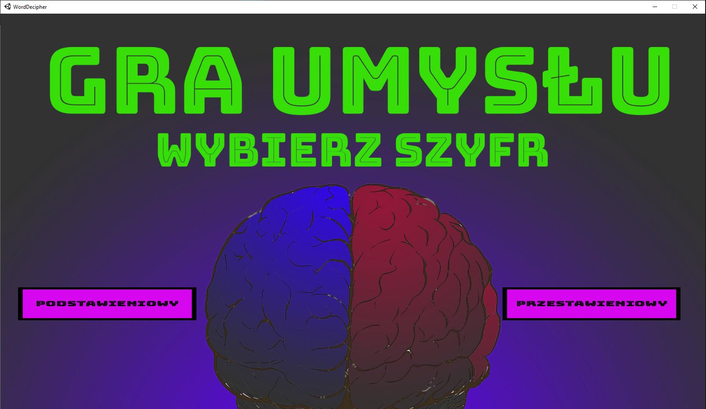
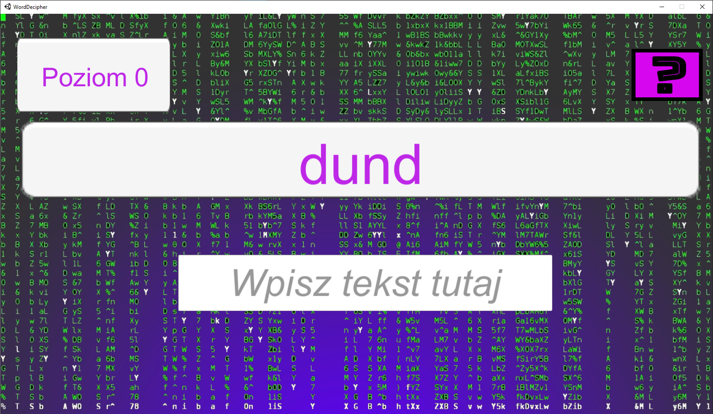

# WordDecipher

/*Polish version below*/   
Simple 2D game created in Unity 

The game user's task is to decipher the given word. The user can choose between a transposition or substitution cipher. After making this selection, an encrypted word appears to the user, which he must decrypt and write in the appropriate form in the text field. After correctly deciphering the word, the user can go to the next level. Then the next encrypted word longer than the previous one appear. After decrypted six words, the user wins the game.

Below interface of this game

 
In folder *Assets/Scripts* there are scripts from the project. 
*WordDecipher.exe* is located in folder *exe*.

    
Prosta gra 2D stworzona w Unity

Zadaniem użytkownika gry jest rozszyfrowanie podanego słowa. Użytkownik może wybrać miedzy szyfrem przestawieniowym a podstawieniowym.  Po dokonaniu tego wyboru użytkownikowi ukazuje sie zaszyfrowane słowo, które musi odszyfrować i napisać w odpowiedniej formie w polu tekstowym. Po poprawnym rozszyfrowaniu słowa uzytkownik może przejść do następnego poziomu.  Wtedy ukazuje się kolejne zaszyfrowane słowo dłuższe od poprzedniego. Po odganieciu sześciu słów użytkownik wygrywa grę.

W folderze *Assets/Scripts* znajdują sie skrypty projektu 
*WordDecipher.exe* znajduje się w folderze *exe*.
